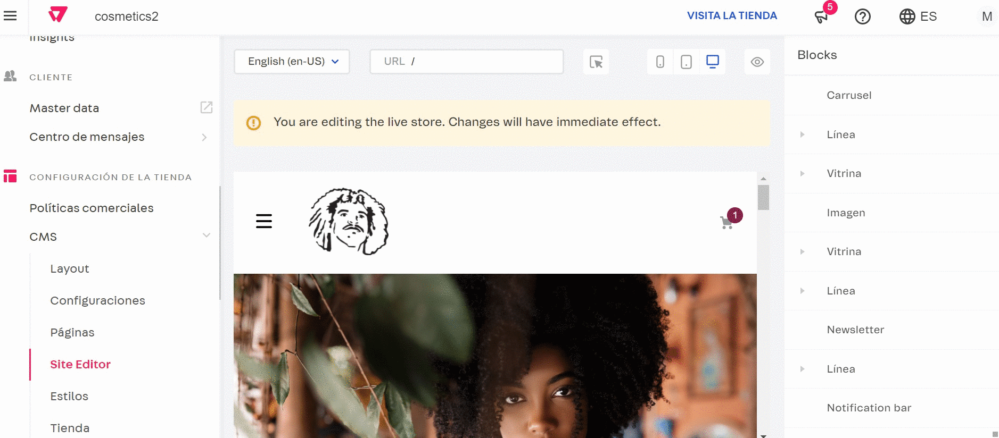

# ¿Qué es VTEX IO?
VTEX IO es una plataforma de comercio electrónico que ayuda a las empresas a crear su propio eCommerce y vender sus productos en línea. A través de VTEX podrás diseñar tu comercio digital, gestionar productos, recibir órdenes de compra y realizar cobros.

## Instalación vía NPM
De acuerdo a tu sistema operativo, sigue los pasos respectivos para instalar el CLI de VTEX IO en tu computadora.

| Sistema Operativo | Instalación | 
| ----------------- | ----------- |
| MacOs | 1. Instale **Homebrew** siguiendo las instrucciones del sitio web de **Homebrew** |
| | 2. Instalar Node.js a través de Homebrew ejecutando el siguiente comando en tu terminal: ```brew install node``` | 
| | 3. Luego, instalar Yarn : ```brew install Yarn``` | 
| | 4. Finalmente, instale el VTEX IO CLI : ```yarn global add vtex```|
| Linux | 1. Instalar Node.js ejecutando el siguiente comando: ```sudo apt install nodejs``` |
| | 2. Instale Yarn siguiendo la instalación de Yarn para Linux | 
| | 3. Instale VTEX IO CLI ejecutando el siguiente comando: ```sudo yarn global add vtex``` | 
| Windows | 1. Descargue e instale Node.js |
| | 2. Descarga e instala Yarn | 
| | 3. Usa la terminal de Windows con permisos de administrador |
| | 4. Instale VTEX IO CLI ejecutando el siguiente comando: ```yarn global add vtex``` |


Verifica la instalación usando el comando ```vtex``` te deberá mostrar una lista de comandos de vtex y la versión de vtex instalada como se muestra a continuación:

 

### Solución de Problemas de Instalación
Si al ejecutar ```vtex -v``` aparece la versión es porque fue instalado correctamente, de lo contrario reinicia tu computadora porque podría ser un problema de registro.

# VTEX STOREFRONT

Basado en la plataforma de desarrollo VTEX IO y la tecnología React , VTEX Store Framework es responsable de construir el Storefront, proporcionando componentes nativos de comercio electrónico, todos escritos en **JSON**.
Para comenzar a utilizar VTEX IO, primero se debe configurar el entorno de desarrollo, por lo que se necesita instalar el CLI, loguearse en la cuenta **(cliente)**, crear un espacio de trabajo **(workspace)**, y finalmente acceder a la tienda mediante el espacio de trabajo. 

# Configurar Entorno de Desarrollo
## Comandos Básicos de VTEX

| Comando | Uso |
| ------- | --- |
| vtex login | Esto abrirá una nueva página en el navegador que nos redirigirá a un inicio de sesión | 
| vtex use + nombre de tu workspace | Una vez que inicies sesión por defecto estarás en el workspace de Máster, ten cuidado!! Lo siguiente es crear tu propio workspace usando este comando Esto creará tu espacio de trabajo donde podrás realizar tus cambios sin afectar master!! |
| vtex whoami | Asegurate de que estás en tu workspace usando este comando. Esto te informará en qué cuenta estás logueado, el correo que estás usando y el nombre de tu workspace donde estás trabajando |
| vtex ls | Para ver qué dependencias, aplicaciones o qué temas están instaladas en el workspace usamos el comando: Desplegará una lista con todas las aplicaciones o temas que tiene tu workspace | 
| vtex browse | Para visualizar tu proyecto usamos este comando. Abrirá una ventana en tu navegador con tu proyecto |
| vtex link | Nos vincula el proyecto con el navegador, y cada que se realiza un cambio, se actualiza automáticamente |
| vtex unlink | Nos desvincula el proyecto del navegador | 
| vtex logout | Para salir de tu inicio de sesión | 


# Workspace

## ¿Qué es un Workspace? 
Un workspace es un espacio de trabajo aislado de otros espacios, por ejemplo como una rama de git. Existen 3 tipos de ambiente en **vtex**:

| Ambiente | Permite | No permite |
| -------- | ------- | ---------- | 
| Development | Vinculaciones & Desarrollos | Promover a máster | 
| Producción  | Instalaciones, Recibir tráfico a nivel de producción y llegar a promover a máster | Vinculaciones para desarrollar apps |
| Máster | Contenido presentado al usuario final & Contenido 100% validado | 

## Comandos de Workspace

| Comando | Descripción | 
| ------- | ----------- | 
| workspace abtest | Crea, finaliza o muestra el estado de una prueba | 
| workspace delete | Elimina uno o varios espacios de trabajo de la cuenta actual | 
| workspace list | Enumera todos los espacios de trabajo de la cuenta actual | 
| workspace promote | Promueve el espacio de trabajo actual para dominar. (Solo funciona para espacios de trabajo de producción) | 
| workspace reset | Limpia todas las configuraciones de un espacio de trabajo y las vuelve a crear | 
| workspace status | Muestra información sobre el espacio de trabajo especificado | 
| workspace use | Crea y cambia a un nuevo espacio de trabajo o simplemente cambia  a uno existente | 

También puedes usar el comando ```vtex workspace``` para visualizar los comandos en tu consola.

[Más información](https://www.youtube.com/watch?v=YYo7Ii9_w3s&list=PLTmvmjdoacBR-Dimz5k_DV8-CyLGYfi9i&index=4)

# Init & Link. 
Iniciar el tema de la tienda & 
vincularlo con la tienda

Para utilizar store framework, hay que instalar store theme. Para iniciar con la instalación del tema:
```vtex init``` Nos regresa una lista de opciones, seleccionamos la primera store, confirmamos y se va a generar una copia de un repositorio remoto, que incluye una versión mínima de una aplicación.


A nivel raíz tenemos el archivo 'manifest.json', dentro de sus propiedades tenemos:

**“vendor”: “cuenta”**
Esta propiedad es el responsable de la aplicación ya sea quien la desarrolló o le está 
dando soporte y su valor es el nombre de la cuenta(tienda)

**“name”**
Es el nombre de la aplicación

**“versión”**
Respeta la nomenclatura de la versión

**“builder”**
Hace referencia a los constructores para traducir los archivos locales y enviarlos al workspace. Un builder es responsable de procesar, validar y reenviar un bloque de código determinado a un tiempo de ejecución o un marco capaz de ejecutarlo.

**"dependencies"**
Las dependencias son una lista de aplicaciones previamente definidas y desarrolladas que sirven para exportar los diferentes bloques que se van a utilizar en el tema. Si deseamos agregar algún componente, se busca en la documentación y se agrega a esta lista de dependencias.

Para vincular aplicaciones debemos utilizar workspaces de tipo dev Antes de correr el proyecto, en el archivo de manifest.json, se deben cambiar el valor de "vendor" con el nombre de la cuenta, "name" es opcional cambiarlo por el que preferimos o dejarlo, y en "versión" cambiarlo a “0.0.1” que es un patch para una aplicación que apenas se va a desarrollar. Después de estos cambios, entrar a la carpeta en donde se ubica la aplicación y ubicarse en el workspace que estamos trabajando y correr el comando:

```vtex link```
Nos vincula el proyecto con el navegador, y cada que se realiza un cambio, se actualiza automáticamente


Para desvincular el proyecto utilizamos el comando: 

```vtex unlink```
Nos desvincula el proyecto del navegador

[Más información](https://www.youtube.com/watch?v=bXjb1ApVDWk&list=PLTmvmjdoacBR-Dimz5k_DV8-CyLGYfi9i&index=5)

## Builder
La implementación de la aplicación debe relacionarse con los constructores declarados en el archivo del manifest.json de la aplicación y vivir dentro de las carpetas nombradas sobre los constructores de la aplicación.

## Tipos de Builder
Esta es una lista de constructores VTEX IO:


| Nombre | Funcionalidad | Beta Abierta |
| ------ | ------------- | ------------ |
| admin | Exporta bloques y rutas al VTEX Admin | No abierta | 
| assets | Maneja los activos utilizados por los bloques de temas de la tienda. Obtiene todas las rutas de activos utilizadas y las sube a la base de datos VTEX IO | No abierta |
| configuration | Le permite asignar código perteneciente a configuraciones de servicio a una aplicación que es independiente de la plataforma. | No abierta |
| dotnet | Interpreta el /dotnetdirectorio, potenciando el desarrollo de servicios backend personalizados | No abierta | 
| graphql | Procesa las API y los esquemas de GraphQL interpretando .graphqllos .gqlarchivos contenidos en el /graphqldirectorio de la aplicación | No abierta |
| services | Obtiene los trabajadores de servicio exportados por las aplicaciones instaladas de la cuenta y los agrupa en un solo archivo, lo que permite que la tienda trabaje con varios trabajadores de servicio simultáneament | No abierta| 
| styles | Exporta configuraciones de CSS para bloques de Store Framework. Al compilar su aplicación, el generador de estilos lee el styles/styles.json y usa un generador de taquiones para producir correctamente el CSS de su tienda | Abierta | 
| store | Interpreta y valida los bloques, las interfaces y las rutas contenidas en el /storedirectorio de la aplicación del tema, potenciando los componentes de la tienda Store Framework y construyendo el escaparate | Abierta |
| messages | Exporta mensajes de cadena localizados, potenciando la internacionalización de VTEX IO . Lee .jsonarchivos asociados con diferentes configuraciones regionales dentro del /messagesdirectorio de la aplicación y los pone a disposición de las aplicaciones front-end para que los usen a través de react-intl | Abierta | 
| node | Interpreta el /nodedirectorio, lo que permite el desarrollo de servicios de back-end personalizados mediante Typescript | No abierta |
| pixel | Procesa el código fuente y la configuración de las Pixel Apps en VTEX IO. Los archivos recogidos por este constructor se encuentran en el /pixeldirectorio de la aplicación | No abierta |
| react | Interpreta el /reactdirectorio, potenciando el desarrollo de componentes de React usando Typescript | Abierta |

## Permisos para los tipos de builders

# OVERVIEW ADMIN 
El Admin permite a los comerciantes gestionar todas sus experiencias de comercio digital en un solo lugar, de forma más sencilla e inteligente.
La barra lateral es el punto de partida para todas las áreas de administración. Vea a continuación los detalles sobre su funcionamiento y posibilidades.

# Storefront Apps Admin
Aprovechando la plataforma VTEX IO, la solución VTEX IO Store Framework ofrece las bases necesarias para cualquier estructura de escaparate, proporcionando bloques de tienda React personalizables y de alta calidad para que pueda crear (en el tiempo de comercialización más rápido posible). Experiencias de compra integrales que nunca se vuelven obsoletas.
Sin embargo, considerando algunos escenarios comerciales particulares, es posible que sienta la necesidad de soluciones front-end específicas que aún no están cubiertas por nuestros componentes nativos. En este caso, puede desarrollar sus propias aplicaciones de escaparate con React y VTEX IO

## Instalación de Apps 
En el apartado de Apps Store, verás la lista de aplicaciones disponibles para la cuenta que estas gestionando.


# Site Editor



# Checkout UI

# REACT + PROPS CÓMO CREAR BLOQUES PERSONALIZADOS EN VTEX IO
Blocks Props, identificadores, blocks

Los blocks son los json desarrollados por VTEX, y son una abstracción de un componente React. Deben estar declarados en las dependencias del manifest.json y editar su contenido en donde se estén utilizando dichos bloques. 
Para personalizar un componente, en los bloques se hace mediante la propiedad “props”, se debe leer la documentación de VTEX IO, y ubicar los bloques para ver qué propiedades se pueden utilizar en cada bloque.
Es una buena práctica que cada bloque tenga su identificador, de la siguiente manera:

# Templates

Los Templates son archivos que contienen el código de las páginas de tu sitio web. Son responsables, entre otras cosas, de determinar cómo aparecerá la información en la pantalla. La estructura de las secciones de la tienda se deben mediante templates, que a su vez mandan a llamar los blocks correspondientes a cada módulo requerido para las diferentes funcionalidades de cada página.


# Páginas que compone una tienda

## Home Page
El home page es la portada de tu tienda web, aquí es donde encontrarás la página de inicio que se muestra en un navegador web cuando se abre la aplicación por primera vez.

## Header
	El header hace referencia a la parte superior del sitio web, los usuarios puedan
	navegar fácilmente por él.

## Footer
	Es la parte inferior de una página web, en la que se incluye una serie de elementos
	que pueden resultar de interés para el usuario que navega por ella, como enlaces a
	las categorías principales, información de contacto, redes sociales o enlaces a textos
	legales.

## PLP  (Product Listing Page) 
En ecommerce es la página destinada a listar una serie de productos que responden a un mismo criterio de búsqueda o clasificación, siendo esa la definición de sus siglas: 
Página de Listado de Producto.


## PDP (Product Detail Page)
En la estructura de un ecommerce, PDP es la página de descripción de producto o lo que es lo mismo, la ficha del propio producto.


## Checkout
El checkout en ecommerce es la parte final del proceso de compra, cuando el cliente confirma el carrito con los productos o servicios seleccionados, introduce sus datos y completa el pago. 


# Nuevas Funcionalidades Checkout
SE PLANTEA EL REDISEÑO DEL CHECKOUT PARA EVITAR USAR UNA GRAN CANTIDAD DE COMPONENTES PERSONALIZADOS Y LOGRAR USAR LAS NUEVAS FUNCIONALIDADES QUE EL CHECKOUT NOS OFRECE

## Order split and delivery split
Una de las opciones que se planea realizar es la separación de las formas de envío en el pedido.

Con vtex checkout nos es posible hacer una división de pedidos y división de entregas

Se busca lograr que todas las opciones de entrega disponibles se mostrarán en el proceso de Checkout, se busca poder hacer una selección individual de cada producto para el tipo de envío o recoger en tienda y poder juntar varios productos en el mismo envío.

#### Pasos a seguir para la configuración

1. Accederemos a nuestro Admin de vtex
2. Si no hay pickup points disponibles estos se crearan en la sección de Orders, Inventory & shipping, Pickup Points
	- Daremos click en Add pickup Point
	- Se deberá llenar los apartados:
		- Name
		- Id
		- Pickup Point Address
		- Business Hours
3. Una vez configurado nuestro pickup point en nuestro menu lateral seleccionaremos Orders y seleccionaremos shipping Strategy
	- En esta sección se debe crear una "shipping policy", daremos click en el botón create shipping policy.
	- Se deberá llenar los apartados:
	- Name
	- id
	- Shipping method
	- Upload shipping Rates, deberemos dar click en choose a file y seleccionar un documento compatible.
	- Seccion package items
		- Minimum of items
		- Minimum value
		- Maxium value	
	- Link pickup points se debera habilitar y llenar los apartados:
		- Pickup points names.
4. Iremos a la sección Loading Docks -En esta sección deberemos crear un Loading Dock, daremos click en botón create loading dock
	- Se deberá llenar los apartados:
		 -Name
		- id
		- Sección Shipping policies and Sales Channel
			- Asignaremos "associated shipping policies" y "sales policy"
	- Deberemos llenar los apartados Time and Priority
		- Cost Time
		- Overhead time
		- Priority
	- Se asignara una dirección en el campo Address
5. Iremos a la seccion Warehouses -En esta sección deberemos crear un Warehouse, daremos click en botón create Warehouse
	- Se deberá llenar los apartados:
		- Name
		- Id
		- Origin
			- Daremos click en add loading dock para ligar el warehouse con el loading dock
		- inStore warehouse (podrá activarse para activar un pickup point) y seleccionar los disponibles.
6. Iremos a la sección Inventory Management
	- Se buscara el producto que se quiera dar disponibilidad en el warehouse creado anteriormente y se le dara el inventario correspondiente y se guardaran los cambios.

7. Para demostrar que la configuración fue correcta usaremos la herramienta Shipping Simulator.
	- Iremos a la seccion Shipping Simulator
	- Y deberemos llenar los siguientes datos:
		- Country
		- Select product
		- Postal code
	- Daremos click en calculate y nos arrojara todos los detalles de la compra

8. Para lograr que esto sea mostrado en el checkout de nuestra pagina se deben hacer las siguientes configuraciones:

	- Se debera habilitar el allowMultipleDeliveries ( esto se realizara con un request hecho al orderForm
	- Se debe recuperar la configuración actual para eso se usara la solicitud de obtener "Get orderForm Configuration" esto para evitar sobrescribir los valores antiguos.
	- Se realizara una petición tipo POST. https://{accountName}.{environment}.com.br/api/checkout/pvt/configuration/orderForm Con el dato allowMultipleDeliveries habilitado. Update orderForm configuration

9. Realizaremos una configuración dentro del administrador en el apartado de checkout

	- Accederemos a la seccion haciendo click en la lupa del administrador y escribiendo checkout
	- Daremos click en el engrane de nuestro checkout
	- Y nos di  rigiremos a la pestaña checkout
	- Buscaremos la opción Optimized shipping options y se deberá desactivar

10. Para seguir con nuestras configuraciones del checkout debemos hacer 2 configuraciones en las aplicaciones instaladas en vtex (checkout ui custom y social selling)
	- Checkout ui custom, podemos acceder a esta sección buscando en la lupa que nos ofrece el administrador de vtex.

		- Una vez dentro debemos activar las opciones:
		- Payment option as accordion
		- Simplified shipping date
		- Show item's unit price
		- Show 'notes' field
		- Hide e-mail step
		-  Google Address Form Format
		- Daremos click en publish
	- Social selling, podemos acceder a esta seccion buscando desde la lupa de vtex escribiendo "my apps" dentro de este menu buscaremos "social selling" y daremos click en settings.

		- Una vez dentro debemos activar las opciones:
		- Enables the app
		- App always enabled by default
		- App enabled by default for telesales operators
		- Enables the configuration of seller identifiers ( Active, add utmiCampaing, Add marketingTag)
		- Visible sharing channels (whatsapp, Facebook Messenger, SMS, Link, Gmail, Email)
		- Daremos click en Save

## Setting up Cart Abandonment (Trigger)

El carrito abandonado es la funcionalidad de VTEX que envía correos electrónicos a los clientes para recordarles que paguen en un carrito que se ha ensamblado pero no se ha completado.

## Change the price of an item in the shopping cart

En VTEX, las tiendas pueden establecer manualmente el precio de un artículo ( SKU ) disponible en el carrito de pago. Esta característica se llama Precio manual y solo puede ser realizado por personas que tengan los siguientes perfiles de acceso y permiso registrados en VTEX Admin:

-Perfil de acceso: Propietario ( Admin Super ) u Operador del centro de llamadas ( Telesales )

-Permiso: Carrito de compras Acceso completo

La seguridad operativa de esta funcionalidad se basa en controlar el acceso de las personas que tienen perfiles específicos ( mencionados anteriormente ), sin los cuales el precio de un artículo no puede modificarse manualmente. Además, todos los cambios de precios realizados son registrados y rastreables. 

## SmartCheckout - Customer information automatic fill-in

Con SmartCheckout, la información del cliente se completa automáticamente en Checkout, y solo debe ingresar el correo electrónico de su tienda. Esta función reduce el tiempo de compra ya que los clientes no necesitan volver a ingresar sus datos para cada compra realizada en la misma tienda.

- Cliente ( CL )

	- Correo electrónico
	- Nombre
	- Apellido
	- Teléfono de casa
	- Documento
	- DocumentType

- Dirección ( AD )

	- Nombre de dirección
	- DirectionType
	- País
	- Estado
	- Código postal o geocoordenadas
	- Calle
	- Nombre del receptor

## Change item limit of same SKU in cart

Puede cambiar la cantidad máxima de artículos del mismo SKU que sus clientes pueden insertar en el carrito en cada pedido.

## Omitting a payment condition

Dado que VTEX permite que se registren múltiples puertas de enlace, adquirentes y su asociación correspondiente con los medios de pago de manera fácil y rápida, algunos usuarios pueden querer incluir promociones o incluso asociaciones, con un medio de pago exclusivo.

## Setting up geolocation at checkout

Esta función permite que las entregas utilicen un punto geográfico como base ( latitud y longitud ) en lugar de un código postal.

La función de geolocalización permite a sus clientes administrar sus propias búsquedas de la dirección de entrega requerida.

En otras palabras, al finalizar la compra pueden usar una herramienta con la capacidad de encontrar direcciones en Google Maps con un icono que marca la posición.

Esto le da al usuario confirmación visual de que el pedido se entregará en la dirección requerida. La información de ubicación se completará automáticamente tan pronto como se cargue el punto en el mapa.

## Cartman

Cartman es una herramienta creada para auxiliar al comerciante en el análisis de posibles escenarios en el Checkout, simulando, compartiendo e investigando carritos en tiendas VTEX

### Funciones cartman.

**Obtenga información sobre artículos en el carrito:**
Al acceder a la Ver detalles del carrito menú, es posible verificar la información específica de cada uno de los productos seleccionados en el carrito

**Agregar ítems específicos al carrito:**
Agregar ítems por ID de SKU, se pueden agregar nuevos ítems al carrito de acuerdo con su código de identificación (ID de SKU).

**Agregar ítems aleatorios al carrito:**
Agregar ítems al azar, nuevos ítems del catálogo de la tienda se pueden agregar al carrito al azar (sin especificar qué ítem se agregará).

**Establecer datos de marketing**
En la opción establecer datos de marketing, puede aplicar cupones de descuento a ítems y promociones específicos en función de la información de marketing.
